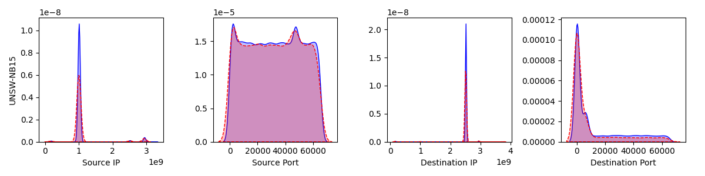

# NF-GAN
### Use NF-GAN to generate more network flows
Network flow generation is important under different network analysis scenarios. For different generation tasks, the datasets chosen and the network attributes selected are different. So please configure the settings for your specific dataset. The parameters for the dataset is recorded in the file (/conf/params.json).  
<ul>
  <li>file_path: the path for the train set</li>
  <li>dataset_features: the features in dataset</li>
  <li>dataset_dtypes: the data types for the features</li>
  <li>generated_features: the features to generate for new flows</li>
</ul>  
The dataset used in our experiment is [UNSW-NB15](https://ieeexplore.ieee.org/document/7348942), which is a dataset for network security.  
The hyper-parameters for NF-GAN architecture are also stored in the file (/conf/params.json). The training procedure of NF-GAN follows the suggestions from [ganhacks](https://github.com/soumith/ganhacks)  
To run the code:  
```
python seq_gan.py
```
After training, the parameters of the generator and discriminator are stored under the sub-directory /conf. The record of generated network flows is stored under the sub-directory /target. The analysis of the statistical results are stored under the sub-directory /stats
### Distribution Comparison
Based on UNSW-NB15 dataset, we used train set (/data/train.csv) to train NF-GAN model and generate 20000 network flows which are recorded in the target file (/target/traffic-1.csv). Then we compare the distributions of flows in the test set (/data/test.csv) and the generated flows. The result is as follows. The red line is the distribution of the generated flows whereas the blue line is the distribution of the real flows.

